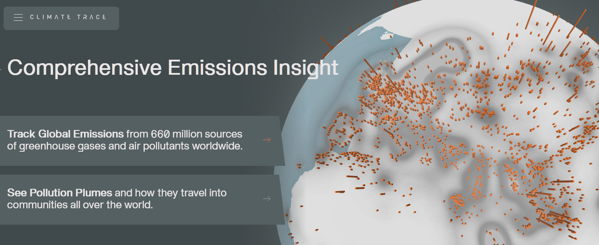
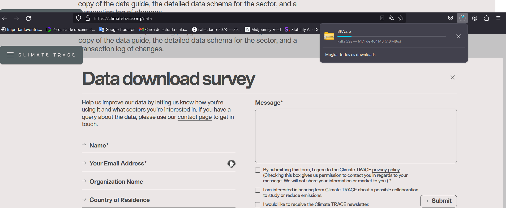
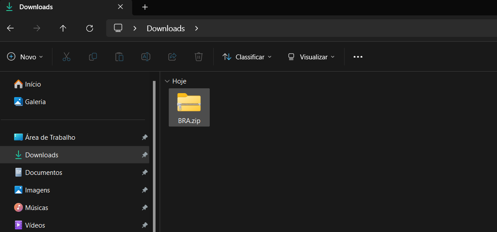
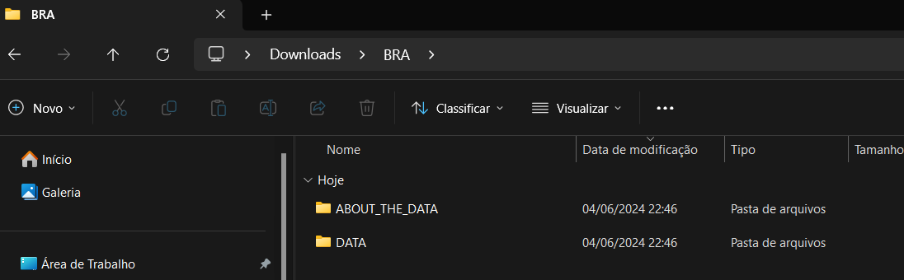
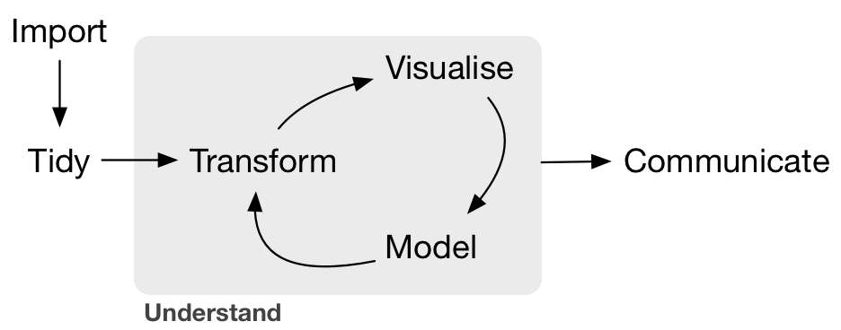

<!-- README.md is generated from README.Rmd. Please edit that file -->

```{r, include = FALSE}
knitr::opts_chunk$set(
  collapse = TRUE, warning = FALSE,
  error = FALSE, message = FALSE,
  comment = "#>"
)
```


```{r echo=FALSE, out.width = "100%", fig.align = "left", fig.cap=""}
  
```


# Introdução às Mudanças Climáticas Globais: Monitoramento de Emissões e Capturas de Gases do Efeito Estufa

No minicurso falaremos sobre as bases físicas das mudanças climáticas globais, impactos, adaptações e necessidades de mitigação. Exploraremos também a plataforma [Climate TRACE](https://climatetrace.org/) para monitoramento de emissões de gases do efeito estufa em nível nacional. Além disso, haverá uma atividade prática com aquisição de dados, pré-processamento e visualização de dados com o R. 

---

## 1) Apresentações

{width=5%}
 
### [Panorama das emissões no Brasil](https://raw.githubusercontent.com/arpanosso/curso-gp-03-climate-trace/master/Docs/apresentacao_daCosta.pdf)


### [Bases Físicas das MCG](https://raw.githubusercontent.com/arpanosso/curso-gp-03-climate-trace/master/Docs/apresentacao-LaScala.pdf)

{width=5%}

[Mudanças do Clima - 2023 Relatório Síntese-pt.br](https://raw.githubusercontent.com/arpanosso/curso-gp-03-climate-trace/master/Docs/IPCC_Longer_Report_2023_Portugues.pdf)

___

## 2) Plataforma [Climate TRACE](https://climatetrace.org/)

---

## 3) Aquisição de Dados

Nesta atividade, você aprenderá a navegar na plataforma [Climate TRACE](https://climatetrace.org/), selecionar a base de dados de interesse, no caso vamos baixar os dados do Brasil, e fazer o download dos dados para uso em seus projetos.

### Passo a Passo

**Acesse a Plataforma**  
  + Abra seu navegador de internet preferido.   
  + Digite o endereço da plataforma na barra de endereços (https://climatetrace.org/) ou clique no link de acesso.



**Criação de Conta ou Login**  
  + No momento, não é necessário criar uma conta ou fazer login na plataforma para acessar os dados.    
  + Provavelmente, essa opção será implementada no futuro.  
  + Portanto, você pode prosseguir diretamente para a navegação e download dos dados.

**Navegação até a Base de Dados**  
  + No canto direito inferior, clique no botão {width=15%}.  
  + Você será direcionado para a página abaixo. 
  
  
  
  + Observe que a aquisição de dados poderá ser feita via download ou por API (Interface de Programação de Aplicações). Nessa prática, por questões didáticas, optaremos pela aquisição via download.  
  + Role a página para baixo até encontrar a seção ou aba chamada "Bases de Dados", "Data Sets" ou algo semelhante. Clique nesta opção.
  

  
  + Clique nesta opção **Country**.  
  + Uma nova página será carregada dinamicamente com o alfabeto para auxiliar na procura das bases de dados disponíveis.
  + Clique em **B** e procure por *BRAZIL*.
  
  

**Download dos Dados**  
 + Encontre o botão .  
 + Clique sobre ele para fazer o download dos dados no formato CSV.   
 +  O download será iniciado automaticamente.   
 + Aguarde até que o arquivo seja salvo em seu computador.
 
 **OBS:** CSV (Comma-Separated Values) é um formato de arquivo simples e amplamente utilizado para armazenar dados tabulares.

  

Após o download terminar, acesse a pasta de downloads do seu computar e observe o arquivo:

 

**Lidando com Arquivos ZIP**

  + Muitas vezes, os dados são compactados em um arquivo ZIP para facilitar o download. Um arquivo ZIP é um formato de arquivo que contém um ou mais arquivos compactados para reduzir o tamanho total e facilitar a transferência.   
  + Para descompactar o arquivo ZIP:  
      + No Windows: Clique com o botão direito no arquivo ZIP e selecione "Extrair Tudo...", depois siga as instruções para escolher um local onde os arquivos serão extraídos.  
      + Por padrão, os dados serão descompatados dentro de uma pasta com nome BRA, semelhante ao nome do arquivo baixado, localizada no mesmo diretório onde o arquivo **BRA.zip** se encontra.
  + Após descompactar, você verá os arquivos de dados e metadados que podem ser abertos e analisados.

 

**OBS:** Metadados são informações adicionais que descrevem os dados principais. Eles podem incluir: descrição das variáveis; explicação do que cada coluna ou campo de dados representa; unidades usadas; ou seja, qualquer outra informação relevante que ajude a entender e utilizar os dados corretamente.

**Dicas Adicionais**  
  + *Organização*: Crie uma pasta dedicada em seu computador para armazenar os dados baixados, facilitando a organização e o acesso futuro.  
  + *Documentação*: Leia a [documentação](https://github.com/climatetracecoalition/methodology-documents/tree/main/2023) ou notas técnicas fornecidas pela plataforma para entender melhor os dados e suas limitações: [Link](https://climatetrace.org/approach).  
  + *Backup*: Sempre faça backup dos dados importantes para evitar perdas acidentais.

---

## 4) Pré-Processamento de Dados (Faxina de Dados)

O pré-processamento de dados, ou faxina de dados, é uma das etapas mais importantes do Data Science. Antes de realizar qualquer análise ou construção de modelos, é essencial garantir que os dados estejam limpos e estruturados corretamente. 


O Ciclo do Data Science.

Dados de má qualidade podem levar a resultados imprecisos e análises equivocadas. Por isso, dedicar tempo ao pré-processamento assegura que as análises subsequentes sejam baseadas em informações confiáveis e precisas.

**4.1) Carregar Pacotes**

```{r}
library(tidyverse) 
library(treemapify)
library(geobr)
source("R/base_map.R") 
source("R/my_function.R")
```

**4.2) Importação dos Dados**

Importe os dados para o software de análise que você está utilizando (Excel, R, Python, etc.).

```{r}
dados_crus <- read_rds("data-raw/BRA.rds")
glimpse(dados_crus)
```

### Observe o mesmo banco de dados em [BRA.xlsx](https://raw.githubusercontent.com/arpanosso/curso-gp-03-climate-trace/master/data-raw/BRA.xlsx)

### O qual deverá ser estruturado/faxinado para [emissoes_br.xlsx](https://raw.githubusercontent.com/arpanosso/curso-gp-03-climate-trace/master/data/emissoes_br.xlsx)

**4.3) Correção de Inconsistências**

Verifique e corrija valores ausentes (*missing values* ou *Not Available* - NA) e inconsistências nos dados. 

```{r}
skimr::skim(dados_crus)
```

**4.4) Verificar os tipos primários**

Verifique o tipo primário das variáveis, transforme, se necessário. Por exemplo, vamos transformar as variáveis "_time" e "_date" para datas, ao invés de caracteres. 

```{r}
dados_crus <- dados_crus %>%
  mutate(
    start_time = as_date(start_time),
    end_time = as_date(end_time),
    created_date = as_date(created_date),
    modified_date = as_date(modified_date)
  ) 
glimpse(dados_crus)
```

**4.5) Extraia informações importantes**

Algumas valiosas informações estão presentes nas variáveis, por exemplo, observe a variável `directory`:

```{r}
dados_crus$directory[1]
```
Ela identifica qual o caminho dentro do computador do arquivo CSV compilado em `dados_crus`. Essa coluna possui informações a respeito do setor de emissão e seu respectivo sub-setor:  
  + Setor: "forestry_and_land_use"  
  + Sub-setor "forest-land-fires"

Então, como estratégia, vamos criar duas novas variáveis a partir dessa variável, utilizando função para manipulação de strings.

```{r}
dados_crus <- dados_crus %>%
  mutate(
    sector_name = str_split(directory,
                            "/",
                            simplify = TRUE)[,3],
    sub_sector = str_split(directory,
                           "/",
                           simplify = TRUE)[,4],
    sub_sector = str_remove(sub_sector,"_emissions_sources.csv|_country_emissions.csv")
  )
glimpse(dados_crus)
```

Outro exmplo, a partir da variáveis "end_time" vamos extrair o ano para termos a referência temporal da observação.

```{r}
dados_crus <- dados_crus %>% 
  mutate(year = year(end_time))
glimpse(dados_crus)
```


**4.6) Integração entre bases de dados**

A base do Climate TRACE não possui informações como o Estado, o Município, o Bioma, as Terras Indígenas e as Áreas de Conservação. Essas informações podem ser integralizadas à base a partir do pacote `{geombr}`, desenvolvido pelo IBGE.

```{r}
dados_crus <- dados_crus %>%
  sample_n(2048) %>% 
  group_by(source_name, lon, lat) %>%
  summarise(
    emission = sum(emissions_quantity, na.rm = TRUE)/1e6,
  ) %>%
  mutate(
    sigla_uf = get_geobr_state(lon,lat)
  )
```


Agora é um bom momento para a visualização dos dados
```{r}
dados_crus %>% 
  ggplot(aes(x=lon,y=lat)) +
  geom_point()
```


Utilizando as ferramentas de filtro, podemos inspecionar os pontos por estado.

```{r}
dados_crus %>% 
  filter(sigla_uf == "SP") %>% 
  ggplot(aes(x=lon,y=lat)) +
  geom_point() 
```


**4.7) Demais etapas:**

  + Remoção de Duplicatas    
  + Normalização e Padronização    
  + Tratamento de Outliers    
  + Validação Final    

---


```{r}
# estados  %>%
#   filter(name_state=="São Paulo") %>%
#   ggplot() +
#     geom_sf(fill="lightgray", color="black",
#           size=.15, show.legend = FALSE,
#           alpha=.5) +
#   geom_sf(data=conservacao,
#          color= conservacao %>%
#            pull(code_conservation_unit),
#          fill=NA)+
#   geom_sf(fill=NA, color="black",
#           size=.15, show.legend = T) +
#   lims(x=c(-53,-44.5),y=c(-25,-19.5)) +
#   geom_point(data = dados %>%
#                filter(area_conservacao,
#                       estado=="SP",
#                       ano==2022) %>%
#                group_by(lat,lon) %>%
#                summarise(
#                  emissao = sum(emissao,na.rm = T)/1e6,
#                  .groups = 'drop'
#                )  %>%
#                mutate(
#                  emission_class=case_when(
#                    emissao < -1 ~ "< -1",
#                    emissao < 0 ~ "< 0",
#                    emissao < 1 ~ "< 1",
#                    emissao > 1 ~ "> 1"
#                  )
#                ),
#              aes(x=lon,y=lat,color=emission_class))+
#   labs(color='Emission (M ton C)')+
#   tema_mapa()
```


```{r}
# dados %>%
#   filter(area_conservacao,
#          estado=="SP",
#          ano==2022) %>%
#   group_by(lat,lon) %>%
#   summarise(
#     emissao = sum(emissao,na.rm = T)/1e6,
#     .groups = 'drop'
#   )  %>%
#   mutate(
#     emission_class=case_when(
#       emissao < -1 ~ "< -1",
#       emissao < 0 ~ "< 0",
#       emissao < 1 ~ "< 1",
#       emissao > 1 ~ "> 1"
#     )
#   )  %>%
#   ungroup()  %>%
#   group_by(emission_class)  %>%
#   summarise(e_count = n())
```


```{r}
# dados %>%
#   filter(area_conservacao,
#          estado=="SP",
#          ano==2022) %>%
#   group_by(lat,lon) %>%
#   summarise(
#     emissao = sum(emissao,na.rm = T)/1e6,
#     .groups = 'drop'
#   )  %>%
#   mutate(
#     classe_emissao=case_when(
#       emissao < 0 ~ "sink",
#       .default = "source",
#     )
#   )  %>%
#   ungroup()  %>%
#   group_by(classe_emissao)  %>%
#   summarise(e_count = n(),.groups = 'drop')
```


```{r}
# dados %>%
#   filter(area_conservacao,
#          estado=="SP",
#          ano==2022) %>%
#   filter(setor!='forestry_and_land_use')%>%
#   group_by(setor) %>%
#   summarise(
#     emissao = sum(emissao,na.rm = T)/1e6
#   )%>%
#   arrange(emissao)  %>%
#   ungroup()  %>%
#   mutate(emissao_p = emissao/sum(emissao)*100)  %>%
#   ggplot(aes(area = emissao_p, fill = setor)) +
#   geom_treemap() +
#   geom_treemap_text(
#     aes(label = paste(setor,
#                       paste0(round(emissao_p, 2), "%"), sep = "\n")),
#     colour = "white") +
#   theme(legend.position = "none")
```

```{r}
# dados %>%
#   filter(area_conservacao,
#          estado=="SP",
#          ano==2022) %>%
#   #filter(setor !='forestry_and_land_use')%>%
#   group_by(setor) %>%
#   summarise(
#     emissao = sum(emissao,na.rm = T)/1e6
#   ) %>%
#   ggplot() +
#   geom_col(aes(x=setor,y=emissao,fill=setor),color="black")+
#   labs(x='Setor',y=expression('Emissão (M ton CO'[2]~'eq.)'))+
#   theme(axis.text.x = element_text(angle = 45,hjust = 1),
#         legend.position = "none") +
#   theme_bw()
```


```{r}
# dados %>%
#   filter(area_conservacao,
#          estado=="SP",
#          ano==2022) %>%
#   #filter(setor !='forestry_and_land_use') %>%
#   #group_by(setor) %>%
#   summarise(
#     emissao = sum(emissao,na.rm = T)/1e6,
#     .groups = 'drop'
#   )
```


```{r}
# dados %>%
#   filter(area_conservacao,
#          estado == "SP") %>%
#   #filter(setor != 'forest-land-clearing') |>
#   #group_by(setor) %>%
#   summarise(
#     emissao = sum(emissao,na.rm = T)/1e6,
#     .groups = 'drop'
#   )
```


```{r}
# dados %>%
#   filter(area_conservacao,
#          estado == "SP") %>%
#   group_by(ano) %>%
#   summarise(
#     emissao = sum(emissao,na.rm = T)/1e6,
#     .groups = 'drop'
#   )  %>%
#   ggplot(aes(x=ano, y=emissao))+
#   geom_col(color="black",fill="gray") +
#   theme_bw()
```


```{r}
# dados %>%
#   filter(area_conservacao,
#          estado=="SP") %>%
#   filter(setor != 'forest-land-clearing') |>
#   group_by(setor, ano) %>%
#   summarise(
#     emissao = sum(emissao,na.rm = T)/1e6,
#     .groups = 'drop'
#   ) %>%
#   ggplot()+
#   geom_col(aes(x=ano,y=emissao,fill=setor),
#            position = 'dodge')+
#   labs(x='Setor',y=expression('Emissão (M ton CO'[2]~'eq.)'))+
#   scale_fill_viridis_d()+
#   theme(axis.text.x = element_text(angle = 45,hjust = 1))+
#   theme_bw()
```

