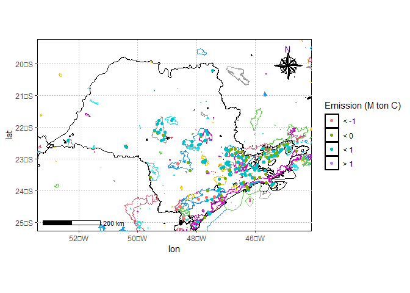

<!-- README.md is generated from README.Rmd. Please edit that file -->


# Introdução às Mudanças Climáticas Globais: Monitoramento de Emissões e Capturas de Gases do Efeito Estufa

No minicurso falaremos sobre as bases físicas das mudanças climáticas
globais, impactos, adaptações e necessidades de mitigação. Exploraremos
também a plataforma [Climate TRACE](https://climatetrace.org/) para
monitoramento de emissões de gases do efeito estufa em nível nacional.
Além disso, haverá uma atividade prática com aquisição de dados,
pré-processamento e visualização de dados com o R.

------------------------------------------------------------------------

 [Panorama das
emissões no
Brasil](https://raw.githubusercontent.com/arpanosso/curso-gp-03-climate-trace/master/Docs/apresentacao-daCosta.pdf)

 [Bases Físicas das
MCG](https://raw.githubusercontent.com/arpanosso/curso-gp-03-climate-trace/master/Docs/apresentacao-daCosta.pdf)

------------------------------------------------------------------------

## Carregando os pacotes necessários

``` r
library(tidyverse)
#> ── Attaching core tidyverse packages ──────────────────────── tidyverse 2.0.0 ──
#> ✔ dplyr     1.1.4     ✔ readr     2.1.5
#> ✔ forcats   1.0.0     ✔ stringr   1.5.1
#> ✔ ggplot2   3.5.1     ✔ tibble    3.2.1
#> ✔ lubridate 1.9.3     ✔ tidyr     1.3.1
#> ✔ purrr     1.0.2     
#> ── Conflicts ────────────────────────────────────────── tidyverse_conflicts() ──
#> ✖ dplyr::filter() masks stats::filter()
#> ✖ dplyr::lag()    masks stats::lag()
#> ℹ Use the conflicted package (<http://conflicted.r-lib.org/>) to force all conflicts to become errors
library(treemapify)
library(geobr)
#> Loading required namespace: sf
source("R/base_map.R")
source("R/my_function.R")
#> Using year/date 2010
#> Using year/date 2019
#> Using year/date 201909
#> Using year/date 201907
```

``` r
dados <- read_rds('data/emissoes_br.rds')
```

``` r
dados %>%
  distinct(ano)
#> # A tibble: 10 × 1
#>      ano
#>    <dbl>
#>  1  2015
#>  2  2016
#>  3  2017
#>  4  2018
#>  5  2019
#>  6  2020
#>  7  2021
#>  8  2022
#>  9  2014
#> 10  2023
```

``` r
estados <- read_rds("data/estados.rds")
conservacao <- read_rds("data/conservacao.rds")
```

``` r
estados <- geobr::read_state()
#> Using year/date 2010
conservacao <- geobr::read_conservation_units()
#> Using year/date 201909
conservacao %>%
  filter(str_detect(name_organization,"SP"))
#> Simple feature collection with 44 features and 14 fields
#> Geometry type: MULTIPOLYGON
#> Dimension:     XY
#> Bounding box:  xmin: -50.46609 ymin: -24.52833 xmax: -45.00285 ymax: -20.8225
#> Geodetic CRS:  SIRGAS 2000
#> First 10 features:
#>    code_conservation_unit
#> 1                    2606
#> 2                    2605
#> 3                    2587
#> 4                    2578
#> 5                    2699
#> 6                    3977
#> 7                    2617
#> 8                    3474
#> 9                    3577
#> 10                   3141
#>                                      name_conservation_unit id_wcm
#> 1                                ESTAçãO ECOLóGICA DE AVARé   <NA>
#> 2                              ESTAçãO ECOLóGICA DE MARíLIA   <NA>
#> 3                   PARQUE NATURAL MUNICIPAL AUGUSTO RUSCHI   <NA>
#> 4                           PARQUE NATURAL MUNICIPAL BORORÉ   <NA>
#> 5                        ESTAçãO ECOLóGICA DE SANTA BáRBARA   <NA>
#> 6  ÁREA DE PROTEÇÃO AMBIENTAL MUNICIPAL DA SERRA DO GUARARU   <NA>
#> 7                           ESTAçãO ECOLóGICA DE MOGI-GUAçU   <NA>
#> 8                 ESTAçãO ECOLóGICA BRáULIO GUEDES DA SILVA   <NA>
#> 9                    ÁREA DE PROTEÇÃO AMBIENTAL BALEIA SAHY   <NA>
#> 10                       PARQUE NATURAL MUNICIPAL JACEGUAVA   <NA>
#>                      category group government_level creation_year  gid7
#> 1           Estação Ecológica    PI         estadual          2010  6602
#> 2           Estação Ecológica    PI         estadual          2010  6600
#> 3                      Parque    PI        municipal          2010  6447
#> 4                      Parque    PI        municipal          2012 11538
#> 5           Estação Ecológica    PI         estadual          1984  6984
#> 6  Área de Proteção Ambiental    US        municipal          2012 16908
#> 7           Estação Ecológica    PI         estadual          1984  6637
#> 8           Estação Ecológica    PI        municipal          2017 13165
#> 9  Área de Proteção Ambiental    US        municipal          2013 13998
#> 10                     Parque    PI        municipal          2012 11555
#>                                                                             quality
#> 1         Aproximado (O poligono representa uma estimativa dos limites da unidade).
#> 2         Aproximado (O poligono representa uma estimativa dos limites da unidade).
#> 3  Correto (O poligono corresponde ao memorial descritivo do ato legal de criação).
#> 4  Correto (O poligono corresponde ao memorial descritivo do ato legal de criação).
#> 5         Aproximado (O poligono representa uma estimativa dos limites da unidade).
#> 6  Correto (O poligono corresponde ao memorial descritivo do ato legal de criação).
#> 7         Aproximado (O poligono representa uma estimativa dos limites da unidade).
#> 8  Esquemático (O poligono é uma representação esquemática da dimensão da unidade).
#> 9  Correto (O poligono corresponde ao memorial descritivo do ato legal de criação).
#> 10 Correto (O poligono corresponde ao memorial descritivo do ato legal de criação).
#>                                  legislation dt_ultim10    code_u111
#> 1            Decreto nº 56.616 de 29/12/2010 24/09/2019 0000.35.2606
#> 2            Decreto nº 56.561 de 29/12/2010 24/09/2019 0000.35.2605
#> 3  Lei ordinária nº 8.195/2010 de 24/09/2010 24/08/2015 4990.35.2587
#> 4             Decreto nº 52972 de 14/02/2012 13/03/2015 5030.35.2578
#> 5            Decreto nº 22.337 de 08/06/1984 24/09/2019 0000.35.2699
#> 6  Decreto nº Decreto nº 9.948 de 29/06/2012 21/10/2019 1870.35.3977
#> 7             Decreto nº 22336 de 08/06/1984 24/09/2019 0000.35.2617
#> 8       Lei ordinária nº 11471 de 06/01/2017 11/09/2019 5220.35.3474
#> 9   Lei ordinária nº 2257/2013 de 23/08/2013 16/04/2018 5070.35.3577
#> 10            Decreto nº 52974 de 14/02/2012 30/03/2015 5030.35.3141
#>                                                                 name_organization
#> 1  Instituto Florestal da Secretaria do Meio Ambiente do Estado de São Paulo - SP
#> 2  Instituto Florestal da Secretaria do Meio Ambiente do Estado de São Paulo - SP
#> 3  Secretaria de Meio Ambiente - Prefeitura Municipal de São José dos Campos - SP
#> 4              Secretaria Municipal do Verde e do Meio Ambiente de São Paulo - SP
#> 5  Instituto Florestal da Secretaria do Meio Ambiente do Estado de São Paulo - SP
#> 6                           Secretaria Municipal de Meio Ambiente de Guarujá - SP
#> 7  Instituto Florestal da Secretaria do Meio Ambiente do Estado de São Paulo - SP
#> 8    Secretaria do Meio Ambiente, Parques e Jardins - Prefeitura de Sorocaba - SP
#> 9                                      Prefeitura Municipal de São Sebastião - SP
#> 10             Secretaria Municipal do Verde e do Meio Ambiente de São Paulo - SP
#>      date                           geom
#> 1  201909 MULTIPOLYGON (((-48.88981 -...
#> 2  201909 MULTIPOLYGON (((-49.92307 -...
#> 3  201909 MULTIPOLYGON (((-45.93327 -...
#> 4  201909 MULTIPOLYGON (((-46.66463 -...
#> 5  201909 MULTIPOLYGON (((-49.23241 -...
#> 6  201909 MULTIPOLYGON (((-46.1262 -2...
#> 7  201909 MULTIPOLYGON (((-47.15396 -...
#> 8  201909 MULTIPOLYGON (((-47.41598 -...
#> 9  201909 MULTIPOLYGON (((-45.66086 -...
#> 10 201909 MULTIPOLYGON (((-46.74315 -...

estados  %>%
  filter(name_state=="São Paulo") %>%
  ggplot() +
    geom_sf(fill="white", color="black",
          size=.15, show.legend = FALSE) +
  geom_sf(data=conservacao %>%
            filter(str_detect(name_organization,"SP")),
         color= conservacao %>%
           filter(str_detect(name_organization,"SP")) %>%
           pull(code_conservation_unit),
         fill=NA)+
  geom_sf(fill=NA, color="black",
          size=.15, show.legend = T) +
  lims(x=c(-53,-44.5),y=c(-25,-19.5)) +
  geom_point(data = dados %>%
               filter(area_conservacao,
                      estado=="SP",
                      ano==2022) %>%
               group_by(lat,lon) %>%
               summarise(
                 emissao = sum(emissao,na.rm = T)/1e6
               )  %>%
               mutate(
                 emission_class=case_when(
                   emissao < -1 ~ "< -1",
                   emissao < 0 ~ "< 0",
                   emissao < 1 ~ "< 1",
                   emissao > 1 ~ "> 1"
                 )
               ),
             aes(x=lon,y=lat,color=emission_class))+
  #scale_color_viridis_d()+
  labs(color='Emission (M ton C)')+
  tema_mapa()
#> `summarise()` has grouped output by 'lat'. You can override using the `.groups`
#> argument.
#> Warning: Removed 3 rows containing missing values or values outside the scale range
#> (`geom_point()`).
```

<!-- -->

``` r
dados %>%
  filter(area_conservacao,
         estado=="SP",
         ano==2022) %>%
  group_by(lat,lon) %>%
  summarise(
    emissao = sum(emissao,na.rm = T)/1e6
  )  %>%
  mutate(
    emission_class=case_when(
      emissao < -1 ~ "< -1",
      emissao < 0 ~ "< 0",
      emissao < 1 ~ "< 1",
      emissao > 1 ~ "> 1"
    )
  )  %>%
  ungroup()  %>%
  group_by(emission_class)  %>%
  summarise(e_count = n())
#> `summarise()` has grouped output by 'lat'. You can override using the `.groups`
#> argument.
#> # A tibble: 4 × 2
#>   emission_class e_count
#>   <chr>            <int>
#> 1 < -1                 7
#> 2 < 0                 55
#> 3 < 1                138
#> 4 > 1                  1
```

``` r
dados %>%
  filter(area_conservacao,
         estado=="SP",
         ano==2022) %>%
  group_by(lat,lon) %>%
  summarise(
    emissao = sum(emissao,na.rm = T)/1e6
  )  %>%
  mutate(
    classe_emissao=case_when(
      emissao < 0 ~ "sink",
      .default = "source",
    )
  )  %>%
  ungroup()  %>%
  group_by(classe_emissao)  %>%
  summarise(e_count = n())
#> `summarise()` has grouped output by 'lat'. You can override using the `.groups`
#> argument.
#> # A tibble: 2 × 2
#>   classe_emissao e_count
#>   <chr>            <int>
#> 1 sink                62
#> 2 source             139
```

``` r
dados %>%
  filter(area_conservacao,
         estado=="SP",
         ano==2022) %>%
  filter(setor!='forestry_and_land_use')%>%
  group_by(setor) %>%
  summarise(
    emissao = sum(emissao,na.rm = T)/1e6
  )%>%
  arrange(emissao)  %>%
  ungroup()  %>%
  mutate(emissao_p = emissao/sum(emissao)*100)  %>%
  ggplot(aes(area = emissao_p, fill = setor)) +
  geom_treemap() +
  geom_treemap_text(
    aes(label = paste(setor,
                      paste0(round(emissao_p, 2), "%"), sep = "\n")),
    colour = "white") +
  theme(legend.position = "none")
```

<!-- -->

``` r
dados %>%
  filter(area_conservacao,
         estado=="SP",
         ano==2022) %>%
  #filter(setor !='forestry_and_land_use')%>%
  group_by(setor) %>%
  summarise(
    emissao = sum(emissao,na.rm = T)/1e6
  ) %>%
  ggplot() +
  geom_col(aes(x=setor,y=emissao,fill=setor),color="black")+
  labs(x='Setor',y=expression('Emissão (M ton CO'[2]~'eq.)'))+
  theme(axis.text.x = element_text(angle = 45,hjust = 1),
        legend.position = "none")
```

<!-- -->

``` r
dados %>%
  filter(area_conservacao,
         estado=="SP",
         ano==2022) %>%
  #filter(setor !='forestry_and_land_use') %>%
  #group_by(setor) %>%
  summarise(
    emissao = sum(emissao,na.rm = T)/1e6
  )
#> # A tibble: 1 × 1
#>   emissao
#>     <dbl>
#> 1   -10.8
```

``` r
dados %>%
  filter(area_conservacao,
         estado == "SP") %>%
  #filter(setor != 'forest-land-clearing') |>
  #group_by(setor) %>%
  summarise(
    emissao = sum(emissao,na.rm = T)/1e6
  )
#> # A tibble: 1 × 1
#>   emissao
#>     <dbl>
#> 1    73.0
```

``` r
dados %>%
  filter(area_conservacao,
         estado == "SP") %>%
  group_by(ano) %>%
  summarise(
    emissao = sum(emissao,na.rm = T)/1e6
  )  %>%
  ggplot(aes(x=ano, y=emissao))+
  geom_col(color="black",fill="gray") +
  theme_bw()
```

<!-- -->

``` r
dados %>%
  filter(area_conservacao,
         estado=="SP") %>%
  filter(setor != 'forest-land-clearing') |>
  group_by(setor, ano) %>%
  summarise(
    emissao = sum(emissao,na.rm = T)/1e6
  ) %>%
  ggplot()+
  geom_col(aes(x=ano,y=emissao,fill=setor),
           position = 'dodge')+
  labs(x='Setor',y=expression('Emissão (M ton CO'[2]~'eq.)'))+
  scale_fill_viridis_d()+
  theme(axis.text.x = element_text(angle = 45,hjust = 1))+
  theme_bw()
#> `summarise()` has grouped output by 'setor'. You can override using the
#> `.groups` argument.
```

<!-- -->
