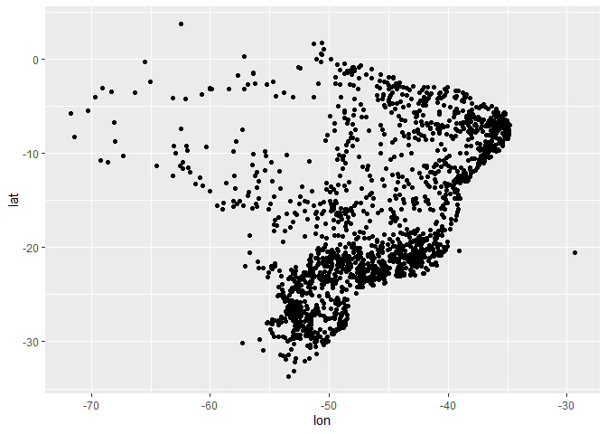
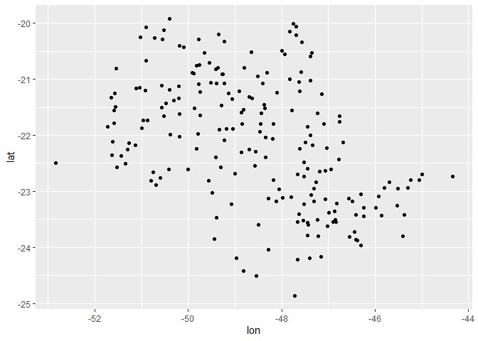
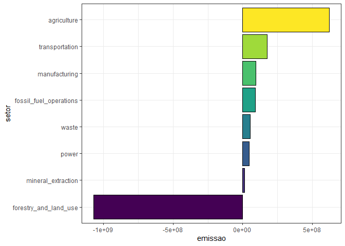

<!-- README.md is generated from README.Rmd. Please edit that file -->


# Introdução às Mudanças Climáticas Globais: Monitoramento de Emissões e Capturas de Gases do Efeito Estufa

No minicurso falaremos sobre as bases físicas das mudanças climáticas
globais, impactos, adaptações e necessidades de mitigação. Exploraremos
também a plataforma [Climate TRACE](https://climatetrace.org/) para
monitoramento de emissões de gases do efeito estufa em nível nacional.
Além disso, haverá uma atividade prática com aquisição de dados,
pré-processamento e visualização de dados com o R.

------------------------------------------------------------------------

## 1) Apresentações


### [Panorama das emissões no Brasil](https://raw.githubusercontent.com/arpanosso/curso-gp-03-climate-trace/master/Docs/apresentacao_daCosta.pdf)

### [Bases Físicas das MCG](https://raw.githubusercontent.com/arpanosso/curso-gp-03-climate-trace/master/Docs/apresentacao-LaScala.pdf)


[Mudanças do Clima - 2023 Relatório
Síntese-pt.br](https://raw.githubusercontent.com/arpanosso/curso-gp-03-climate-trace/master/Docs/IPCC_Longer_Report_2023_Portugues.pdf)

------------------------------------------------------------------------

## 2) Plataforma [Climate TRACE](https://climatetrace.org/)

------------------------------------------------------------------------

## 3) Aquisição de Dados

Nesta atividade, você aprenderá a navegar na plataforma [Climate
TRACE](https://climatetrace.org/), selecionar a base de dados de
interesse, no caso vamos baixar os dados do Brasil, e fazer o download
dos dados para uso em seus projetos.

### Passo a Passo

**Acesse a Plataforma**  
+ Abra seu navegador de internet preferido.  
+ Digite o endereço da plataforma na barra de endereços
(<https://climatetrace.org/>) ou clique no link de acesso.


**Criação de Conta ou Login**  
+ No momento, não é necessário criar uma conta ou fazer login na
plataforma para acessar os dados.  
+ Provavelmente, essa opção será implementada no futuro.  
+ Portanto, você pode prosseguir diretamente para a navegação e download
dos dados.

**Navegação até a Base de Dados**  
+ No canto direito inferior, clique no botão
.  
+ Você será direcionado para a página abaixo.


- Observe que a aquisição de dados poderá ser feita via download ou por
  API (Interface de Programação de Aplicações). Nessa prática, por
  questões didáticas, optaremos pela aquisição via download.  
- Role a página para baixo até encontrar a seção ou aba chamada “Bases
  de Dados”, “Data Sets” ou algo semelhante. Clique nesta opção.


- Clique nesta opção **Country**.  
- Uma nova página será carregada dinamicamente com o alfabeto para
  auxiliar na procura das bases de dados disponíveis.
- Clique em **B** e procure por *BRAZIL*.


**Download dos Dados**  
+ Encontre o botão .  
+ Clique sobre ele para fazer o download dos dados no formato CSV.  
+ O download será iniciado automaticamente.  
+ Aguarde até que o arquivo seja salvo em seu computador.

**OBS:** CSV (Comma-Separated Values) é um formato de arquivo simples e
amplamente utilizado para armazenar dados tabulares.


Após o download terminar, acesse a pasta de downloads do seu computar e
observe o arquivo:


**Lidando com Arquivos ZIP**

- Muitas vezes, os dados são compactados em um arquivo ZIP para
  facilitar o download. Um arquivo ZIP é um formato de arquivo que
  contém um ou mais arquivos compactados para reduzir o tamanho total e
  facilitar a transferência.  
- Para descompactar o arquivo ZIP:
  - No Windows: Clique com o botão direito no arquivo ZIP e selecione
    “Extrair Tudo…”, depois siga as instruções para escolher um local
    onde os arquivos serão extraídos.  
  - Por padrão, os dados serão descompatados dentro de uma pasta com
    nome BRA, semelhante ao nome do arquivo baixado, localizada no mesmo
    diretório onde o arquivo **BRA.zip** se encontra.
- Após descompactar, você verá os arquivos de dados e metadados que
  podem ser abertos e analisados.


**OBS:** Metadados são informações adicionais que descrevem os dados
principais. Eles podem incluir: descrição das variáveis; explicação do
que cada coluna ou campo de dados representa; unidades usadas; ou seja,
qualquer outra informação relevante que ajude a entender e utilizar os
dados corretamente.

**Dicas Adicionais**  
+ *Organização*: Crie uma pasta dedicada em seu computador para
armazenar os dados baixados, facilitando a organização e o acesso
futuro.  
+ *Documentação*: Leia a
[documentação](https://github.com/climatetracecoalition/methodology-documents/tree/main/2023)
ou notas técnicas fornecidas pela plataforma para entender melhor os
dados e suas limitações: [Link](https://climatetrace.org/approach).  
+ *Backup*: Sempre faça backup dos dados importantes para evitar perdas
acidentais.

------------------------------------------------------------------------

## 4) Pré-Processamento de Dados (Faxina de Dados)

O pré-processamento de dados, ou faxina de dados, é uma das etapas mais
importantes do Data Science. Antes de realizar qualquer análise ou
construção de modelos, é essencial garantir que os dados estejam limpos
e estruturados corretamente.

 O Ciclo do Data Science.

Dados de má qualidade podem levar a resultados imprecisos e análises
equivocadas. Por isso, dedicar tempo ao pré-processamento assegura que
as análises subsequentes sejam baseadas em informações confiáveis e
precisas.

**4.1) Carregar Pacotes**

``` r
library(tidyverse) 
library(treemapify)
library(geobr)
source("R/base_map.R") 
source("R/my_function.R")
```

**4.2) Importação dos Dados**

Importe os dados para o software de análise que você está utilizando
(Excel, R, Python, etc.).

``` r
dados_crus <- read_rds("data-raw/BRA.rds")
glimpse(dados_crus)
#> Rows: 100,000
#> Columns: 23
#> $ source_id                 <int> 8173502, 4580584, 20404729, 4530293, 9289668…
#> $ source_name               <chr> "Campo do Tenente", "Matriz de Camaragibe", …
#> $ source_type               <chr> NA, NA, NA, NA, NA, NA, NA, NA, NA, NA, NA, …
#> $ iso3_country              <chr> "BRA", "BRA", "BRA", "BRA", "BRA", "BRA", "B…
#> $ original_inventory_sector <chr> NA, NA, "manure-left-on-pasture-cattle", NA,…
#> $ start_time                <chr> "2021-01-01 00:00:00", "2022-01-01 00:00:00"…
#> $ end_time                  <chr> "2021-12-31 00:00:00", "2022-12-31 00:00:00"…
#> $ lat                       <dbl> -25.977848, -9.104498, -29.362905, -16.62071…
#> $ lon                       <dbl> -49.65640, -35.58160, -51.30492, -43.92882, …
#> $ geometry_ref              <chr> "gadm_BRA.16.59_2", "gadm_BRA.2.55_2", "gadm…
#> $ gas                       <chr> "co2", "ch4", "co2e_100yr", "co2e_100yr", "c…
#> $ emissions_quantity        <dbl> 2587.14882, NA, 105.21137, 89.00585, 0.00000…
#> $ temporal_granularity      <chr> "annual", "annual", "annual", "annual", "ann…
#> $ created_date              <chr> "2023-09-29 00:00:00", "2023-09-29 00:00:00"…
#> $ modified_date             <chr> "2024-02-26 22:15:30.926679", NA, "2023-11-1…
#> $ directory                 <chr> "data-raw/BRA/forestry_and_land_use/forest-l…
#> $ activity                  <dbl> 7354.740884, NA, 239.978673, 231.431143, 3.8…
#> $ activity_units            <chr> "Total Living biomass burned", NA, "animals"…
#> $ emissions_factor          <dbl> 3.517661e-01, NA, 1.506299e-03, NA, NA, 1.26…
#> $ emissions_factor_units    <chr> "unitless emission efficiency factor", NA, "…
#> $ capacity                  <dbl> 4020983.226, NA, 29569.152, 46720.959, 71557…
#> $ capacity_units            <chr> "Total live biomass carbon from annual carbo…
#> $ capacity_factor           <dbl> 1.829090e-03, NA, 8.115846e-03, 4.953476e-03…
```

### Observe o mesmo banco de dados em [BRA.xlsx](https://raw.githubusercontent.com/arpanosso/curso-gp-03-climate-trace/master/data-raw/BRA.xlsx)

### O qual deverá ser estruturado/faxinado para [emissoes_br.xlsx](https://raw.githubusercontent.com/arpanosso/curso-gp-03-climate-trace/master/data/emissoes_br.xlsx)

**4.3) Correção de Inconsistências**

Verifique e corrija valores ausentes (*missing values* ou *Not
Available* - NA) e inconsistências nos dados.

``` r
skimr::skim(dados_crus)
```

|                                                  |            |
|:-------------------------------------------------|:-----------|
| Name                                             | dados_crus |
| Number of rows                                   | 100000     |
| Number of columns                                | 23         |
| \_\_\_\_\_\_\_\_\_\_\_\_\_\_\_\_\_\_\_\_\_\_\_   |            |
| Column type frequency:                           |            |
| character                                        | 15         |
| numeric                                          | 8          |
| \_\_\_\_\_\_\_\_\_\_\_\_\_\_\_\_\_\_\_\_\_\_\_\_ |            |
| Group variables                                  | None       |

Data summary

**Variable type: character**

| skim_variable             | n_missing | complete_rate | min | max | empty | n_unique | whitespace |
|:--------------------------|----------:|--------------:|----:|----:|------:|---------:|-----------:|
| source_name               |         0 |          1.00 |   0 | 117 |   217 |     8453 |          0 |
| source_type               |     92780 |          0.07 |   0 |  38 |    42 |       43 |          0 |
| iso3_country              |         0 |          1.00 |   3 |   3 |     0 |        1 |          0 |
| original_inventory_sector |     62219 |          0.38 |   5 |  36 |     0 |       27 |          0 |
| start_time                |         0 |          1.00 |  19 |  19 |     0 |     6708 |          0 |
| end_time                  |         0 |          1.00 |  19 |  19 |     0 |     6740 |          0 |
| geometry_ref              |         8 |          1.00 |   8 |  46 |     0 |     8683 |          0 |
| gas                       |         0 |          1.00 |   3 |  10 |     0 |        5 |          0 |
| temporal_granularity      |         0 |          1.00 |   3 |   6 |     0 |        5 |          0 |
| created_date              |         0 |          1.00 |  19 |  19 |     0 |      473 |          0 |
| modified_date             |     30289 |          0.70 |   0 |  26 | 11982 |     2887 |          0 |
| directory                 |         0 |          1.00 |  54 |  94 |     0 |       36 |          0 |
| activity_units            |     33096 |          0.67 |   3 |  31 |     0 |       22 |          0 |
| emissions_factor_units    |     33090 |          0.67 |   0 |  44 | 42114 |       40 |          0 |
| capacity_units            |     47644 |          0.52 |   2 |  58 |     0 |       14 |          0 |

**Variable type: numeric**

| skim_variable      | n_missing | complete_rate |        mean |           sd |            p0 |        p25 |        p50 |         p75 |          p100 | hist  |
|:-------------------|----------:|--------------:|------------:|-------------:|--------------:|-----------:|-----------:|------------:|--------------:|:------|
| source_id          |         0 |          1.00 | 10272375.22 | 6.692248e+06 |  6.142400e+04 | 5017306.75 | 8180875.50 | 13166885.00 |  3.070776e+07 | ▇▇▂▃▁ |
| lat                |         8 |          1.00 |      -16.45 | 8.380000e+00 | -3.365000e+01 |     -22.94 |     -18.40 |       -8.46 |  4.680000e+00 | ▃▇▅▆▁ |
| lon                |         8 |          1.00 |      -46.24 | 6.450000e+00 | -7.344000e+01 |     -50.84 |     -46.53 |      -41.24 | -2.932000e+01 | ▁▁▇▇▂ |
| emissions_quantity |     33869 |          0.66 |   -21812.98 | 6.386586e+06 | -1.254345e+09 |       0.00 |     278.03 |     6023.43 |  2.656355e+08 | ▁▁▁▁▇ |
| activity           |     34379 |          0.66 |  2975670.33 | 7.380231e+07 |  0.000000e+00 |     246.67 |    2952.46 |    17022.76 |  8.604243e+09 | ▇▁▁▁▁ |
| emissions_factor   |     77666 |          0.22 |       32.71 | 1.025050e+03 |  0.000000e+00 |       0.00 |       0.00 |        0.23 |  1.523900e+05 | ▇▁▁▁▁ |
| capacity           |     34540 |          0.65 | 43432815.06 | 1.815366e+09 |  0.000000e+00 |    9666.33 |  578777.37 |  2720854.67 |  2.248459e+11 | ▇▁▁▁▁ |
| capacity_factor    |     44035 |          0.56 |        7.54 | 1.550300e+02 |  0.000000e+00 |       0.00 |       0.01 |        0.01 |  2.409000e+04 | ▇▁▁▁▁ |

**4.4) Verificar os tipos primários**

Verifique o tipo primário das variáveis, transforme, se necessário. Por
exemplo, vamos transformar as variáveis “\_time” e “\_date” para datas,
ao invés de caracteres.

``` r
dados_crus <- dados_crus %>%
  mutate(
    start_time = as_date(start_time),
    end_time = as_date(end_time),
    created_date = as_date(created_date),
    modified_date = as_date(modified_date)
  ) 
glimpse(dados_crus)
#> Rows: 100,000
#> Columns: 23
#> $ source_id                 <int> 8173502, 4580584, 20404729, 4530293, 9289668…
#> $ source_name               <chr> "Campo do Tenente", "Matriz de Camaragibe", …
#> $ source_type               <chr> NA, NA, NA, NA, NA, NA, NA, NA, NA, NA, NA, …
#> $ iso3_country              <chr> "BRA", "BRA", "BRA", "BRA", "BRA", "BRA", "B…
#> $ original_inventory_sector <chr> NA, NA, "manure-left-on-pasture-cattle", NA,…
#> $ start_time                <date> 2021-01-01, 2022-01-01, 2020-01-01, 2015-01…
#> $ end_time                  <date> 2021-12-31, 2022-12-31, 2020-12-31, 2015-12…
#> $ lat                       <dbl> -25.977848, -9.104498, -29.362905, -16.62071…
#> $ lon                       <dbl> -49.65640, -35.58160, -51.30492, -43.92882, …
#> $ geometry_ref              <chr> "gadm_BRA.16.59_2", "gadm_BRA.2.55_2", "gadm…
#> $ gas                       <chr> "co2", "ch4", "co2e_100yr", "co2e_100yr", "c…
#> $ emissions_quantity        <dbl> 2587.14882, NA, 105.21137, 89.00585, 0.00000…
#> $ temporal_granularity      <chr> "annual", "annual", "annual", "annual", "ann…
#> $ created_date              <date> 2023-09-29, 2023-09-29, 2023-10-18, 2023-09…
#> $ modified_date             <date> 2024-02-26, NA, 2023-11-15, 2024-01-11, NA,…
#> $ directory                 <chr> "data-raw/BRA/forestry_and_land_use/forest-l…
#> $ activity                  <dbl> 7354.740884, NA, 239.978673, 231.431143, 3.8…
#> $ activity_units            <chr> "Total Living biomass burned", NA, "animals"…
#> $ emissions_factor          <dbl> 3.517661e-01, NA, 1.506299e-03, NA, NA, 1.26…
#> $ emissions_factor_units    <chr> "unitless emission efficiency factor", NA, "…
#> $ capacity                  <dbl> 4020983.226, NA, 29569.152, 46720.959, 71557…
#> $ capacity_units            <chr> "Total live biomass carbon from annual carbo…
#> $ capacity_factor           <dbl> 1.829090e-03, NA, 8.115846e-03, 4.953476e-03…
```

**4.5) Extraia informações importantes**

Algumas valiosas informações estão presentes nas variáveis, por exemplo,
observe a variável `directory`:

``` r
dados_crus$directory[1]
#> [1] "data-raw/BRA/forestry_and_land_use/forest-land-fires_emissions_sources.csv"
```

Ela identifica qual o caminho dentro do computador do arquivo CSV
compilado em `dados_crus`. Essa coluna possui informações a respeito do
setor de emissão e seu respectivo sub-setor:  
+ Setor: “forestry_and_land_use”  
+ Sub-setor “forest-land-fires”

Então, como estratégia, vamos criar duas novas variáveis a partir dessa
variável, utilizando função para manipulação de strings.

``` r
dados_crus <- dados_crus %>%
  mutate(
    sector_name = str_split(directory,
                            "/",
                            simplify = TRUE)[,3],
    sub_sector = str_split(directory,
                           "/",
                           simplify = TRUE)[,4],
    sub_sector = str_remove(sub_sector,"_emissions_sources.csv|_country_emissions.csv")
  )
glimpse(dados_crus)
#> Rows: 100,000
#> Columns: 25
#> $ source_id                 <int> 8173502, 4580584, 20404729, 4530293, 9289668…
#> $ source_name               <chr> "Campo do Tenente", "Matriz de Camaragibe", …
#> $ source_type               <chr> NA, NA, NA, NA, NA, NA, NA, NA, NA, NA, NA, …
#> $ iso3_country              <chr> "BRA", "BRA", "BRA", "BRA", "BRA", "BRA", "B…
#> $ original_inventory_sector <chr> NA, NA, "manure-left-on-pasture-cattle", NA,…
#> $ start_time                <date> 2021-01-01, 2022-01-01, 2020-01-01, 2015-01…
#> $ end_time                  <date> 2021-12-31, 2022-12-31, 2020-12-31, 2015-12…
#> $ lat                       <dbl> -25.977848, -9.104498, -29.362905, -16.62071…
#> $ lon                       <dbl> -49.65640, -35.58160, -51.30492, -43.92882, …
#> $ geometry_ref              <chr> "gadm_BRA.16.59_2", "gadm_BRA.2.55_2", "gadm…
#> $ gas                       <chr> "co2", "ch4", "co2e_100yr", "co2e_100yr", "c…
#> $ emissions_quantity        <dbl> 2587.14882, NA, 105.21137, 89.00585, 0.00000…
#> $ temporal_granularity      <chr> "annual", "annual", "annual", "annual", "ann…
#> $ created_date              <date> 2023-09-29, 2023-09-29, 2023-10-18, 2023-09…
#> $ modified_date             <date> 2024-02-26, NA, 2023-11-15, 2024-01-11, NA,…
#> $ directory                 <chr> "data-raw/BRA/forestry_and_land_use/forest-l…
#> $ activity                  <dbl> 7354.740884, NA, 239.978673, 231.431143, 3.8…
#> $ activity_units            <chr> "Total Living biomass burned", NA, "animals"…
#> $ emissions_factor          <dbl> 3.517661e-01, NA, 1.506299e-03, NA, NA, 1.26…
#> $ emissions_factor_units    <chr> "unitless emission efficiency factor", NA, "…
#> $ capacity                  <dbl> 4020983.226, NA, 29569.152, 46720.959, 71557…
#> $ capacity_units            <chr> "Total live biomass carbon from annual carbo…
#> $ capacity_factor           <dbl> 1.829090e-03, NA, 8.115846e-03, 4.953476e-03…
#> $ sector_name               <chr> "forestry_and_land_use", "forestry_and_land_…
#> $ sub_sector                <chr> "forest-land-fires", "net-shrubgrass", "manu…
```

Outro exmplo, a partir da variáveis “end_time” vamos extrair o ano para
termos a referência temporal da observação.

``` r
dados_crus <- dados_crus %>% 
  mutate(year = year(end_time))
glimpse(dados_crus)
#> Rows: 100,000
#> Columns: 26
#> $ source_id                 <int> 8173502, 4580584, 20404729, 4530293, 9289668…
#> $ source_name               <chr> "Campo do Tenente", "Matriz de Camaragibe", …
#> $ source_type               <chr> NA, NA, NA, NA, NA, NA, NA, NA, NA, NA, NA, …
#> $ iso3_country              <chr> "BRA", "BRA", "BRA", "BRA", "BRA", "BRA", "B…
#> $ original_inventory_sector <chr> NA, NA, "manure-left-on-pasture-cattle", NA,…
#> $ start_time                <date> 2021-01-01, 2022-01-01, 2020-01-01, 2015-01…
#> $ end_time                  <date> 2021-12-31, 2022-12-31, 2020-12-31, 2015-12…
#> $ lat                       <dbl> -25.977848, -9.104498, -29.362905, -16.62071…
#> $ lon                       <dbl> -49.65640, -35.58160, -51.30492, -43.92882, …
#> $ geometry_ref              <chr> "gadm_BRA.16.59_2", "gadm_BRA.2.55_2", "gadm…
#> $ gas                       <chr> "co2", "ch4", "co2e_100yr", "co2e_100yr", "c…
#> $ emissions_quantity        <dbl> 2587.14882, NA, 105.21137, 89.00585, 0.00000…
#> $ temporal_granularity      <chr> "annual", "annual", "annual", "annual", "ann…
#> $ created_date              <date> 2023-09-29, 2023-09-29, 2023-10-18, 2023-09…
#> $ modified_date             <date> 2024-02-26, NA, 2023-11-15, 2024-01-11, NA,…
#> $ directory                 <chr> "data-raw/BRA/forestry_and_land_use/forest-l…
#> $ activity                  <dbl> 7354.740884, NA, 239.978673, 231.431143, 3.8…
#> $ activity_units            <chr> "Total Living biomass burned", NA, "animals"…
#> $ emissions_factor          <dbl> 3.517661e-01, NA, 1.506299e-03, NA, NA, 1.26…
#> $ emissions_factor_units    <chr> "unitless emission efficiency factor", NA, "…
#> $ capacity                  <dbl> 4020983.226, NA, 29569.152, 46720.959, 71557…
#> $ capacity_units            <chr> "Total live biomass carbon from annual carbo…
#> $ capacity_factor           <dbl> 1.829090e-03, NA, 8.115846e-03, 4.953476e-03…
#> $ sector_name               <chr> "forestry_and_land_use", "forestry_and_land_…
#> $ sub_sector                <chr> "forest-land-fires", "net-shrubgrass", "manu…
#> $ year                      <dbl> 2021, 2022, 2020, 2015, 2021, 2019, 2017, 20…
```

**4.6) Integração entre bases de dados**

A base do Climate TRACE não possui informações como o Estado, o
Município, o Bioma, as Terras Indígenas e as Áreas de Conservação. Essas
informações podem ser integralizadas à base a partir do pacote
`{geombr}`, desenvolvido pelo IBGE.

``` r
dados_crus <- dados_crus %>%
  sample_n(2048) %>% 
  group_by(source_name, lon, lat) %>%
  summarise(
    emission = sum(emissions_quantity, na.rm = TRUE)/1e6,
  ) %>%
  mutate(
    sigla_uf = get_geobr_state(lon,lat)
  )
```

Agora é um bom momento para a visualização dos dados

``` r
dados_crus %>% 
  ggplot(aes(x=lon,y=lat)) +
  geom_point()
```

<!-- -->

Utilizando as ferramentas de filtro, podemos inspecionar os pontos por
estado.

``` r
dados_crus %>% 
  filter(sigla_uf == "SP") %>% 
  ggplot(aes(x=lon,y=lat)) +
  geom_point() 
```

<!-- -->

**4.7) Demais etapas:**

- Remoção de Duplicatas  
- Normalização e Padronização  
- Tratamento de Outliers  
- Validação Final

------------------------------------------------------------------------

## 5) Vizualização de dados

``` r
dados <- read_rds('data/emissoes_br.rds')
```

## Emissões para o Brasil em 2022

``` r
dados %>% 
  filter(
    ano == 2022,
    !sub_setor %in% c("forest-land-clearing",
                      "forest-land-degradation",
                      "shrubgrass-fires",
                      "forest-land-fires",
                      "wetland-fires",
                      "removals")
  ) %>% 
  group_by(setor) %>% 
  summarise(
    emissao = sum(emissao, na.rm=TRUE)
  ) %>% 
  ungroup() %>% 
  mutate(
    Acumulada = cumsum(emissao)
  )
#> # A tibble: 8 × 3
#>   setor                       emissao   Acumulada
#>   <chr>                         <dbl>       <dbl>
#> 1 agriculture              622263753.  622263753.
#> 2 forestry_and_land_use  -1069945057. -447681304.
#> 3 fossil_fuel_operations    92340743. -355340561.
#> 4 manufacturing             95008049  -260332512.
#> 5 mineral_extraction        14773711  -245558801.
#> 6 power                     45507000  -200051801.
#> 7 transportation           175547963.  -24503838.
#> 8 waste                     55688769.   31184931.
```

``` r
dados %>% 
  filter(
    ano == 2022,
    !sub_setor %in% c("forest-land-clearing",
                      "forest-land-degradation",
                      "shrubgrass-fires",
                      "forest-land-fires",
                      "wetland-fires",
                      "removals")
  ) %>% 
  group_by(setor) %>% 
  summarise(
    emissao = sum(emissao, na.rm=TRUE)
  ) %>% 
  ungroup() %>% 
  mutate(
    setor = setor %>% fct_reorder(emissao)
  ) %>% 
  ggplot(aes(x=emissao,y=setor,fill = setor)) +
  geom_col(color="black") +
  theme_bw()+
  theme(legend.position = "none") +
  scale_fill_viridis_d()
```

<!-- -->

## Série temporal de Emissões para o Brasil em 2022, por setor

``` r
dados %>% 
  filter(
    ano < 2023,
    !sub_setor %in% c("forest-land-clearing",
                      "forest-land-degradation",
                      "shrubgrass-fires",
                      "forest-land-fires",
                      "wetland-fires",
                      "removals")
  ) %>% 
  group_by(ano, setor) %>% 
  summarise(
    emissao = sum(emissao, na.rm=TRUE)
  ) %>% 
  ungroup() %>% 
  ggplot(aes(x=ano,y=emissao,fill = setor)) +
  geom_col(color="black") +
  theme_bw()
```

<!-- -->

``` r
dados %>% 
  filter(str_detect(municipio,"Jaboticabal"),
         estado == "SP",
         ano == 2022,
         !sub_setor %in% c("forest-land-clearing",
                            "forest-land-degradation",
                            "shrubgrass-fires",
                            "forest-land-fires",
                            "wetland-fires",
                            "removals")
         ) %>% 
  group_by(setor,nome_fonte,sub_setor) %>% 
  summarise(
    emissao = sum(emissao, na.rm=TRUE)
  ) %>% 
  arrange(emissao )  %>% 
  ungroup() %>% 
  mutate(Cumsum = cumsum(emissao))
#> # A tibble: 9 × 5
#>   setor                 nome_fonte                     sub_setor emissao  Cumsum
#>   <chr>                 <chr>                          <chr>       <dbl>   <dbl>
#> 1 forestry_and_land_use Jaboticabal                    net-fore… -17490. -17490.
#> 2 forestry_and_land_use Jaboticabal                    net-shru…   -756. -18246.
#> 3 forestry_and_land_use Jaboticabal                    net-wetl…   -511. -18757.
#> 4 agriculture           Jaboticabal                    manure-l…    965. -17792.
#> 5 agriculture           Jaboticabal                    enteric-…   3352. -14440.
#> 6 agriculture           Jaboticabal                    syntheti…   3568. -10872.
#> 7 waste                 ETE JABOTICABAL   SP           wastewat…   4972.  -5900.
#> 8 transportation        Jaboticabal Urban Area in Jab… road-tra…  98919.  93018.
#> 9 agriculture           Jaboticabal                    cropland… 904747. 997766.
```

``` r
dados %>% 
  filter(str_detect(municipio,"Alta Floresta"),
         estado == "MT",
         ano == 2022,
         !sub_setor %in% c("forest-land-clearing",
                            "forest-land-degradation",
                            "shrubgrass-fires",
                            "forest-land-fires",
                            "wetland-fires",
                            "removals")
         ) %>% 
  group_by(setor,sub_setor) %>% 
  summarise(
    emissao = sum(emissao, na.rm=TRUE)
  ) %>% 
  ungroup() %>% 
  mutate(
    sub_setor = sub_setor %>% fct_reorder(emissao),
    classe = ifelse(emissao > 0,"Fonte","Sumidouro")
  ) %>% 
  mutate(Cumsum = cumsum(emissao)) %>% 
  ggplot(aes(x=emissao,y=sub_setor,fill=classe)) + 
  geom_col(color="black") +
  theme_bw() +
  theme(
    legend.position = "top"
  )
```

<!-- -->

``` r
# estados  %>%
#   filter(name_state=="São Paulo") %>%
#   ggplot() +
#     geom_sf(fill="lightgray", color="black",
#           size=.15, show.legend = FALSE,
#           alpha=.5) +
#   geom_sf(data=conservacao,
#          color= conservacao %>%
#            pull(code_conservation_unit),
#          fill=NA)+
#   geom_sf(fill=NA, color="black",
#           size=.15, show.legend = T) +
#   lims(x=c(-53,-44.5),y=c(-25,-19.5)) +
#   geom_point(data = dados %>%
#                filter(area_conservacao,
#                       estado=="SP",
#                       ano==2022) %>%
#                group_by(lat,lon) %>%
#                summarise(
#                  emissao = sum(emissao,na.rm = T)/1e6,
#                  .groups = 'drop'
#                )  %>%
#                mutate(
#                  emission_class=case_when(
#                    emissao < -1 ~ "< -1",
#                    emissao < 0 ~ "< 0",
#                    emissao < 1 ~ "< 1",
#                    emissao > 1 ~ "> 1"
#                  )
#                ),
#              aes(x=lon,y=lat,color=emission_class))+
#   labs(color='Emission (M ton C)')+
#   tema_mapa()
```

``` r
# dados %>%
#   filter(area_conservacao,
#          estado=="SP",
#          ano==2022) %>%
#   group_by(lat,lon) %>%
#   summarise(
#     emissao = sum(emissao,na.rm = T)/1e6,
#     .groups = 'drop'
#   )  %>%
#   mutate(
#     emission_class=case_when(
#       emissao < -1 ~ "< -1",
#       emissao < 0 ~ "< 0",
#       emissao < 1 ~ "< 1",
#       emissao > 1 ~ "> 1"
#     )
#   )  %>%
#   ungroup()  %>%
#   group_by(emission_class)  %>%
#   summarise(e_count = n())
```

``` r
# dados %>%
#   filter(area_conservacao,
#          estado=="SP",
#          ano==2022) %>%
#   group_by(lat,lon) %>%
#   summarise(
#     emissao = sum(emissao,na.rm = T)/1e6,
#     .groups = 'drop'
#   )  %>%
#   mutate(
#     classe_emissao=case_when(
#       emissao < 0 ~ "sink",
#       .default = "source",
#     )
#   )  %>%
#   ungroup()  %>%
#   group_by(classe_emissao)  %>%
#   summarise(e_count = n(),.groups = 'drop')
```

``` r
# dados %>%
#   filter(area_conservacao,
#          estado=="SP",
#          ano==2022) %>%
#   filter(setor!='forestry_and_land_use')%>%
#   group_by(setor) %>%
#   summarise(
#     emissao = sum(emissao,na.rm = T)/1e6
#   )%>%
#   arrange(emissao)  %>%
#   ungroup()  %>%
#   mutate(emissao_p = emissao/sum(emissao)*100)  %>%
#   ggplot(aes(area = emissao_p, fill = setor)) +
#   geom_treemap() +
#   geom_treemap_text(
#     aes(label = paste(setor,
#                       paste0(round(emissao_p, 2), "%"), sep = "\n")),
#     colour = "white") +
#   theme(legend.position = "none")
```

``` r
# dados %>%
#   filter(area_conservacao,
#          estado=="SP",
#          ano==2022) %>%
#   #filter(setor !='forestry_and_land_use')%>%
#   group_by(setor) %>%
#   summarise(
#     emissao = sum(emissao,na.rm = T)/1e6
#   ) %>%
#   ggplot() +
#   geom_col(aes(x=setor,y=emissao,fill=setor),color="black")+
#   labs(x='Setor',y=expression('Emissão (M ton CO'[2]~'eq.)'))+
#   theme(axis.text.x = element_text(angle = 45,hjust = 1),
#         legend.position = "none") +
#   theme_bw()
```

``` r
# dados %>%
#   filter(area_conservacao,
#          estado=="SP",
#          ano==2022) %>%
#   #filter(setor !='forestry_and_land_use') %>%
#   #group_by(setor) %>%
#   summarise(
#     emissao = sum(emissao,na.rm = T)/1e6,
#     .groups = 'drop'
#   )
```

``` r
# dados %>%
#   filter(area_conservacao,
#          estado == "SP") %>%
#   #filter(setor != 'forest-land-clearing') |>
#   #group_by(setor) %>%
#   summarise(
#     emissao = sum(emissao,na.rm = T)/1e6,
#     .groups = 'drop'
#   )
```

``` r
# dados %>%
#   filter(area_conservacao,
#          estado == "SP") %>%
#   group_by(ano) %>%
#   summarise(
#     emissao = sum(emissao,na.rm = T)/1e6,
#     .groups = 'drop'
#   )  %>%
#   ggplot(aes(x=ano, y=emissao))+
#   geom_col(color="black",fill="gray") +
#   theme_bw()
```

``` r
# dados %>%
#   filter(area_conservacao,
#          estado=="SP") %>%
#   filter(setor != 'forest-land-clearing') |>
#   group_by(setor, ano) %>%
#   summarise(
#     emissao = sum(emissao,na.rm = T)/1e6,
#     .groups = 'drop'
#   ) %>%
#   ggplot()+
#   geom_col(aes(x=ano,y=emissao,fill=setor),
#            position = 'dodge')+
#   labs(x='Setor',y=expression('Emissão (M ton CO'[2]~'eq.)'))+
#   scale_fill_viridis_d()+
#   theme(axis.text.x = element_text(angle = 45,hjust = 1))+
#   theme_bw()
```
